# make-the-most-of-wsl
How to configure wsl to run and debug .net core projects from windows

## TL;DR;
Hi, 
So Windows finally understood that linux is necessary and finally added WSL into it's OS. Good move.


So, I was super excited on using WSL and wanted to run all my services (.net core, node and docker projects) in linux to test the cross-platform compatibility of my services in linux environment.


What started as a experiment, has got me hooked and I was running all my services in linux environment which inturn started to use less computation resources and things were running comparatively fast.


But, the one thing that was stopping me from using linux as the OS for my development machine because windows never created Visual Studio for linux (There is VS Code but it is not there yet for .net core projects compared to Visual Studio). But with WSL you can access and debug code that is living and running in your WSL with Visual Studio that is installed in your windows machine (i.e. best of both worlds). 

In Short

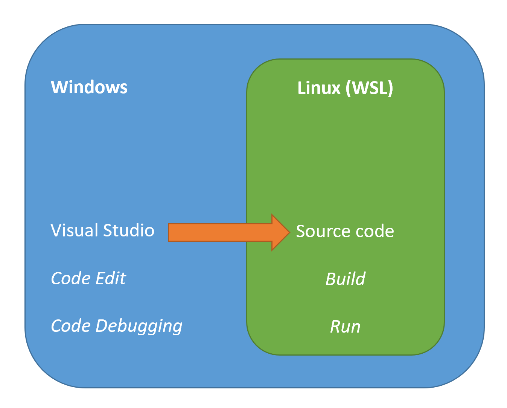

Now, with that out of the away, let get to the real stuff.

___
## Requirements

* Windows 10, version 1903 (x64) or version 2004 (ARM64)
* WSL 2 (you can get the instructions here https://docs.microsoft.com/en-us/windows/wsl/install-win10)
* Windows Terminal (optional) (https://devblogs.microsoft.com/commandline/introducing-windows-terminal/)
* A strong coffee


## Getting source code into WSL

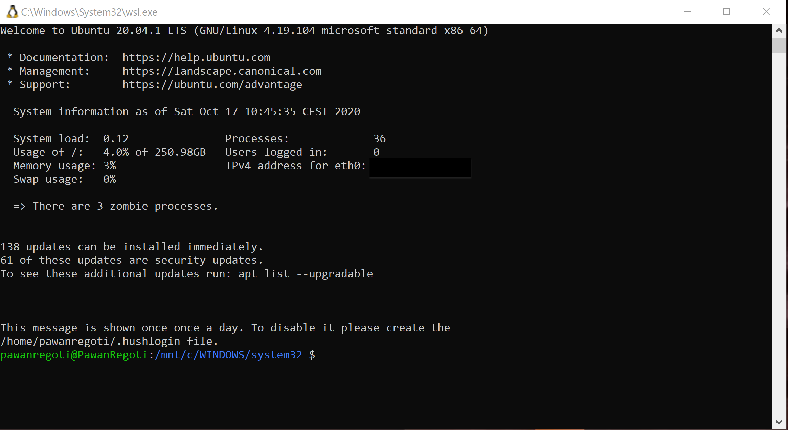

Open wsl and go to root by typing `cd` and press enter, then create a `src` folder (name is not relevant here just a folder to store all your source code)

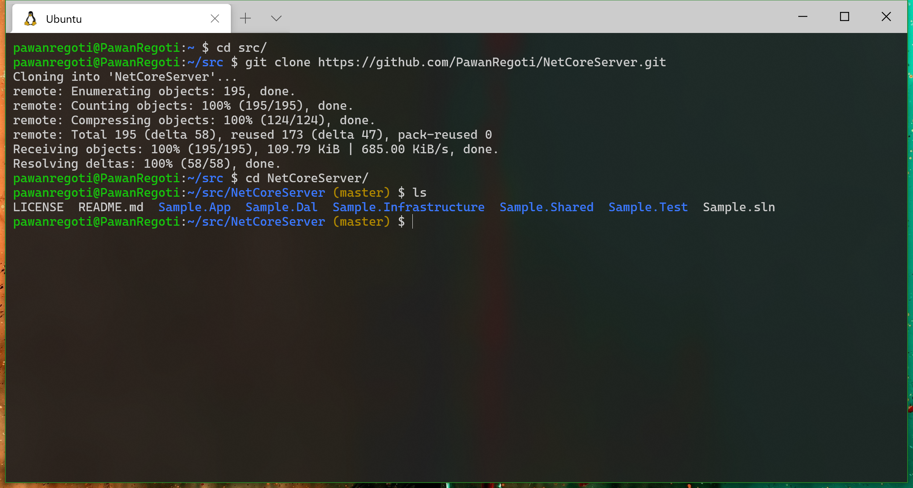

now you can build and run the .net core project using `dotnet` commands (for that you need to install `dotnet-cli` into your WSL (https://docs.microsoft.com/en-in/dotnet/core/install/linux))

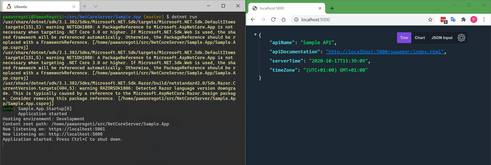

you can start editing the code at this point by just typing `code .` to open current folder in VS Code.

For node project, more or less, that is it. 🎉

For .net core projects keep reading. 🤓


## Accessing source code from WSL

In WSL, go to `src` folder and type `explorer.exe .` and BOOM

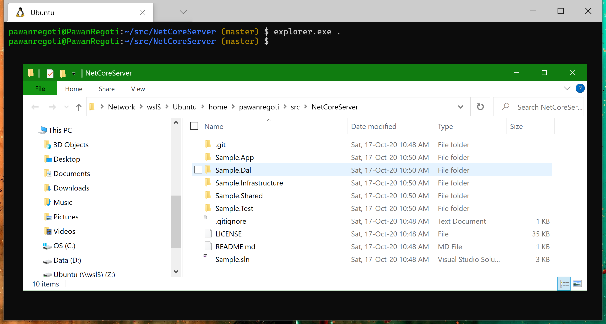

At this point, you may be tempted to double click the `.sln` file and load the project in visual studio. But, it won't work. _why you ask_ (https://github.com/docker/for-win/issues/8749#issuecomment-702160997)

Fortunately, there is a work around. you can map the WSL as a network drive and then Visual Studio has no problems reading the files.

click on `wsl$` in address bar in explorer, then you will see this

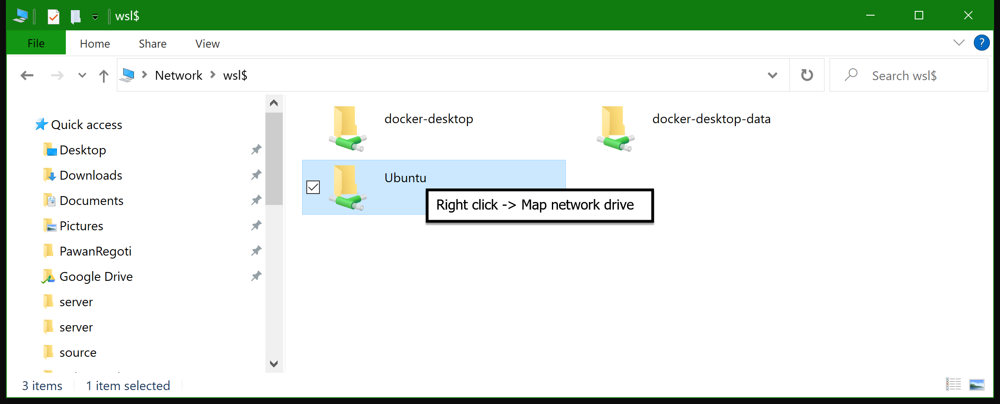

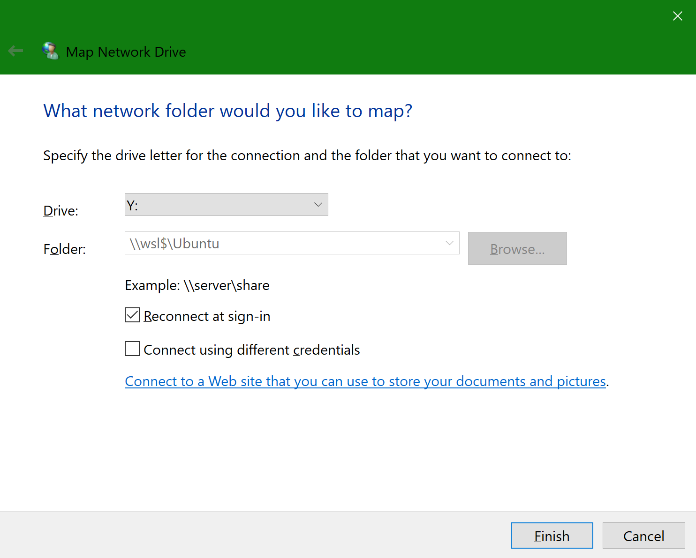

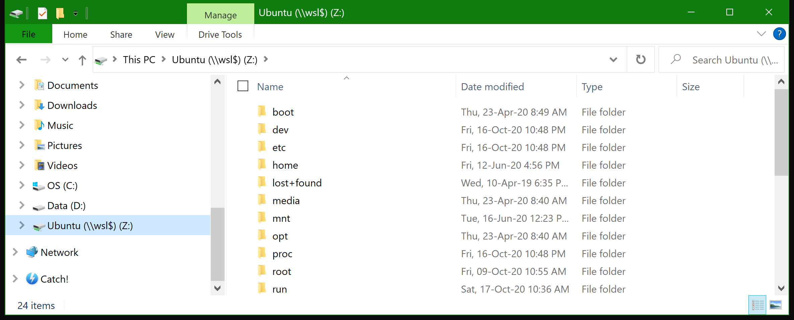

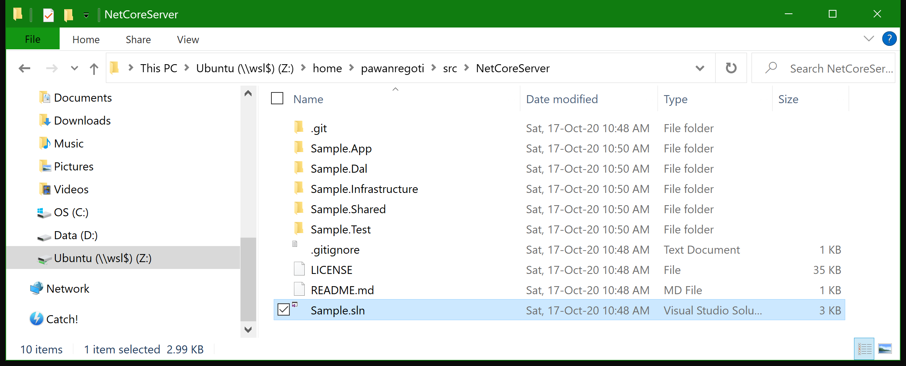

Now, you can double click the `.sln` file and go crazy.

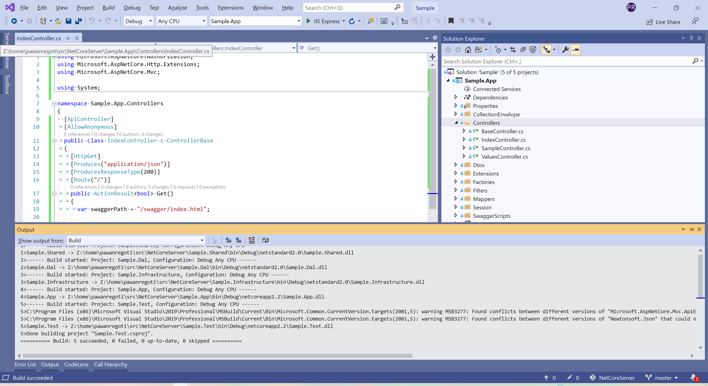


## Debugging the code

To debug the code you need to install `ssh` and `vsdbg` in your WSL. (https://medium.com/criteo-labs/wsl-visual-studio-attaching-launching-a-linux-net-core-application-on-my-window-10-ab21c179702d)

Steps to install `vsdbg` in WSL
1. `sudo apt-get install unzip`
2. `curl -sSL https://aka.ms/getvsdbgsh | bash /dev/stdin -v latest -l ~/vsdbg`


Steps to setup `ssh` in WSL
1. `sudo apt-get remove openssh-server`
2. `sudo apt-get install openssh-server`
3. `sudo apt-get install nano` (to edit sshd_config)
4. `sudo nano /etc/ssh/sshd_config`

make sure you have following settings in `sshd_config`
```
Port 22
LogLevel INFO
PermitRootLogin yes
PasswordAuthentication yes
ChallengeResponseAuthentication no
UsePAM yes
AllowAgentForwarding yes
X11Forwarding yes
PrintMod no
AcceptEnv LANG_LC_*
Subsystem sftp /usr/lib/openssh/sftp-server
```

5. `sudo service ssh start`

Test if you are able to connect to `ssh` from your windows terminal/cmd 

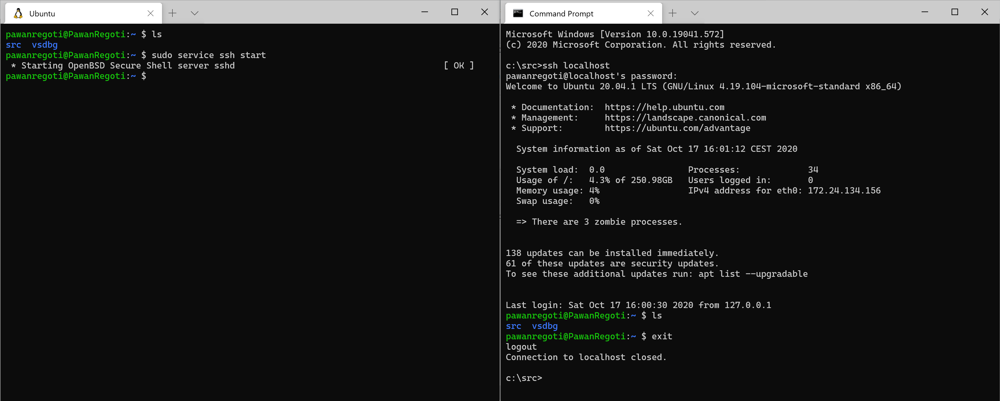

Now, in Visual Studio, go to `Debug -> Attach to Process` (`Ctrl + Alt + P`)

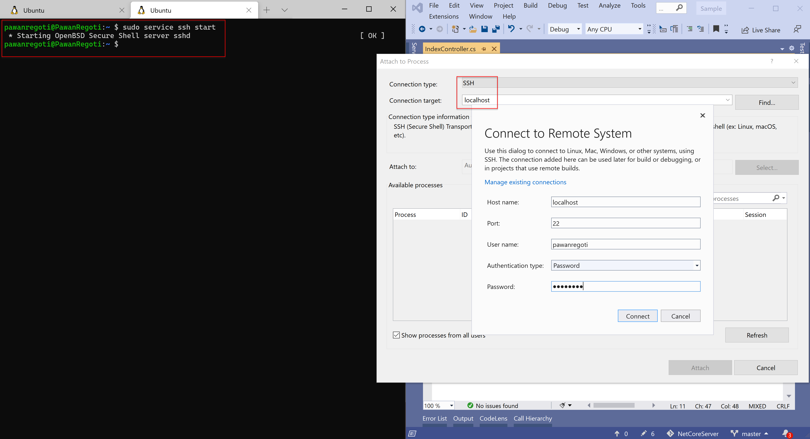

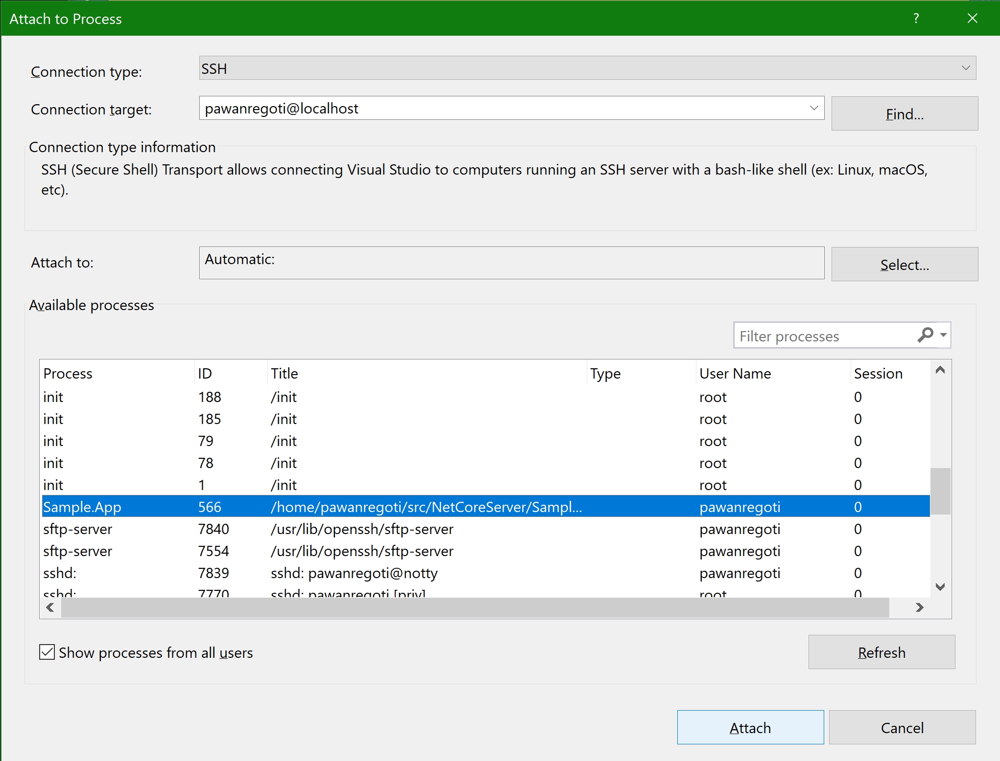

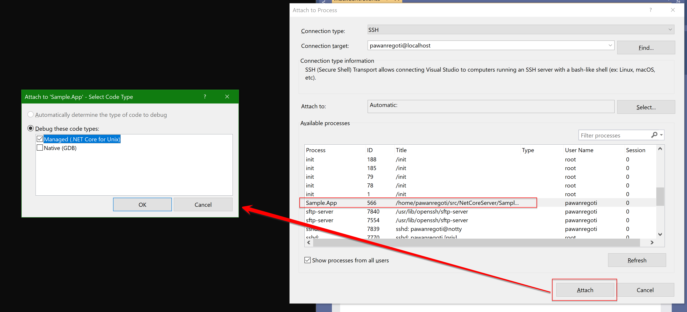

And then, __Voilà__

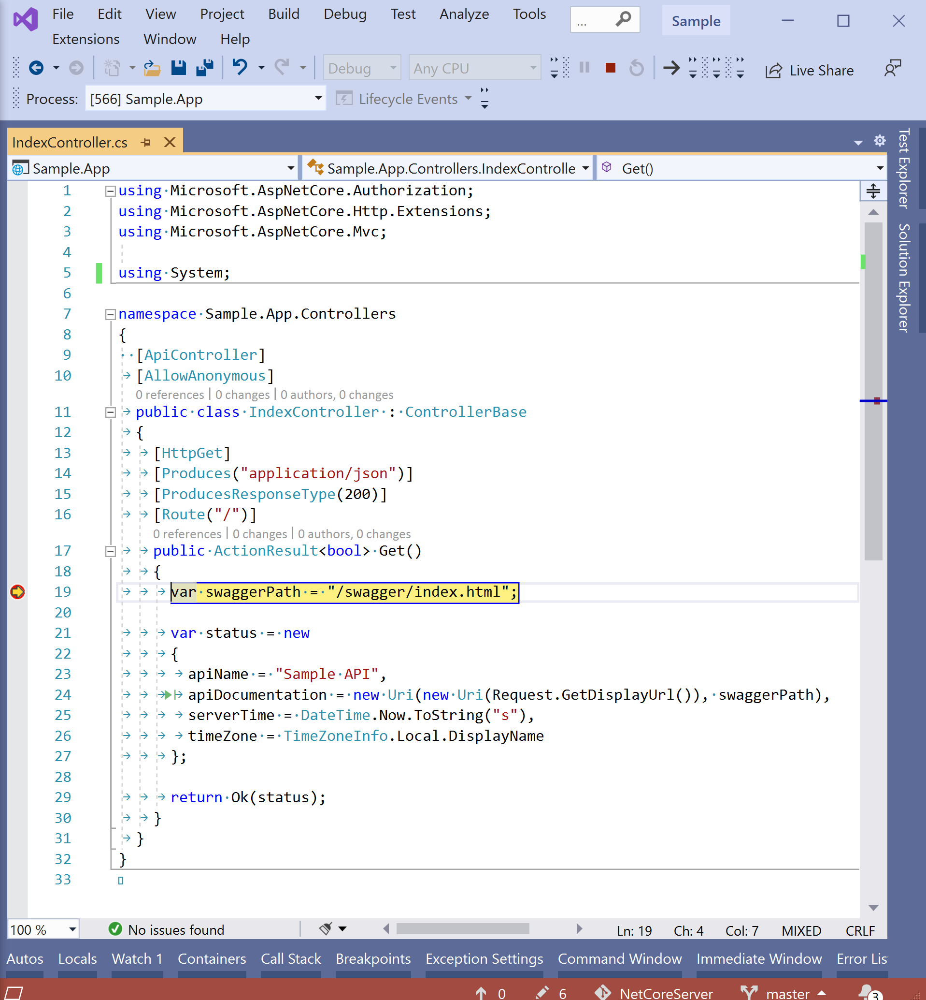

Now you can debug and edit any dotnet core project from Visual Studio as if it is inside your c: or d: drive.

Here is the reward for reaching till the finish line.


_professor snuggles approves your dedication_ 😄
